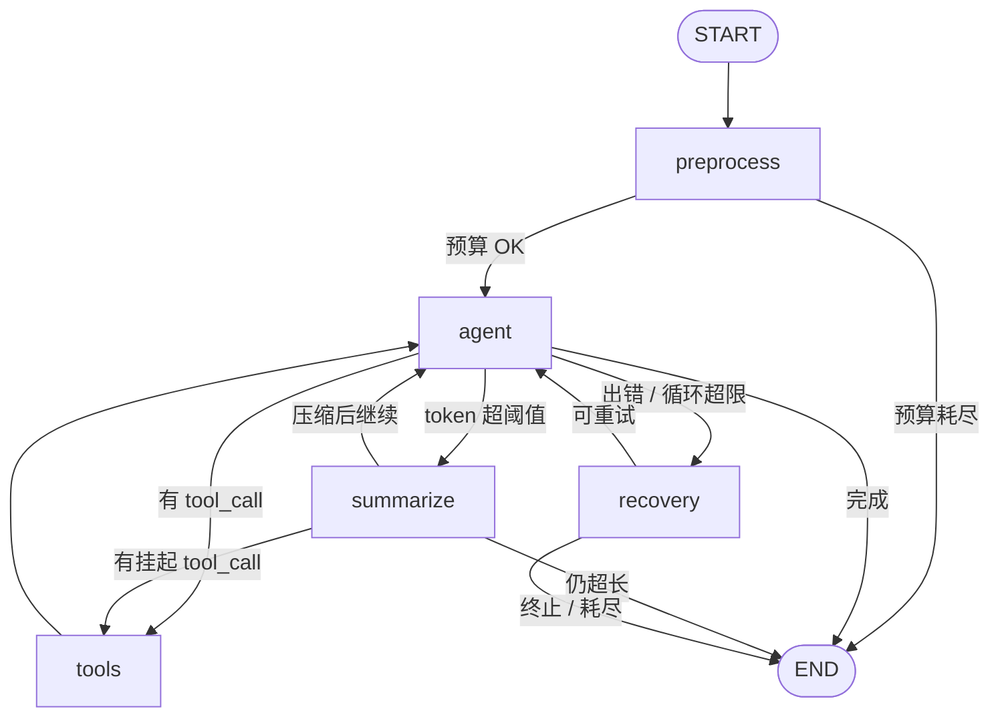
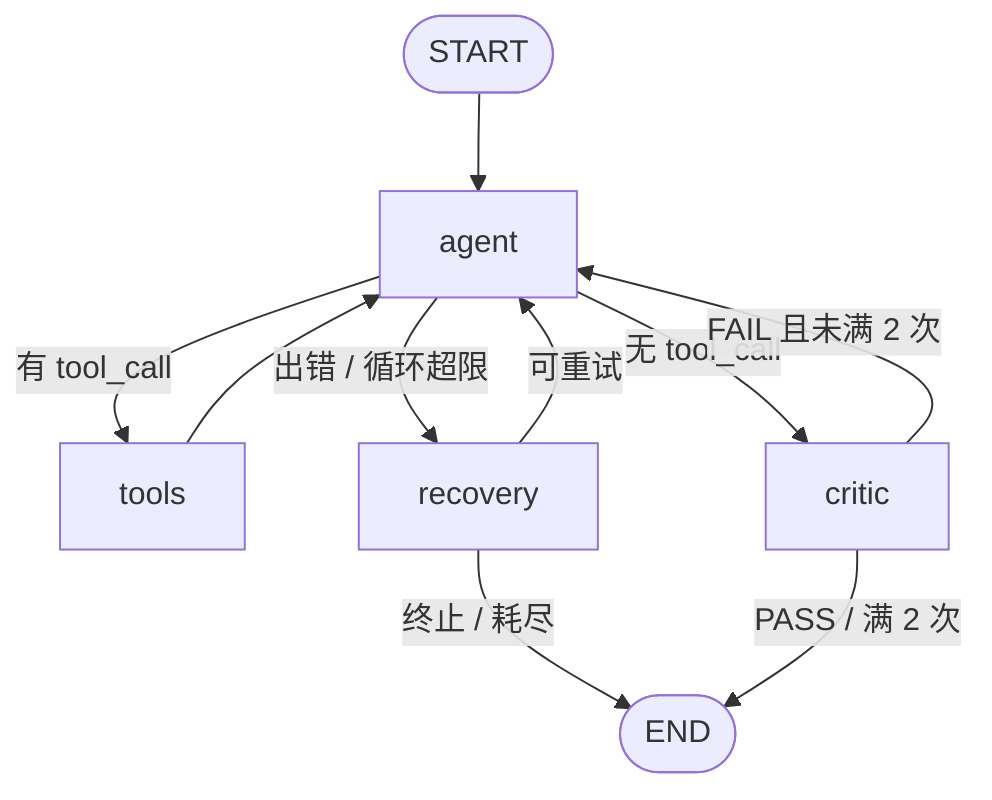

# LangGraph 图拓扑与终止性

Vanta 的对话编排由两张 LangGraph 图构成：**主图**（主代理）与**子图**（`run_agent` 派生的子代理）。本文件是它们拓扑的人类可读镜像，**真值在代码**——主图见 `harness/agent/graph/build.py` + `routes.py`，子图见 `harness/agent/graph/subagent/build.py` + `nodes.py`。改动这些文件时请同步本文件。

每张图都满足一个不变量：**任意路径都在有限步内收敛到 `END`**——每个循环都有计数上限或硬逃生边，不存在回不到终点的死循环。边按角色分三类：

- **正常流** — 推进任务的前向边；
- **回边** — 循环内回到 `agent` 继续；
- **逃生边** — 通向 `END` 的终止出口，保证收敛。

---

## 主图（main graph）

- 装配：`harness/agent/graph/build.py` → `build_graph()`
- 路由：`harness/agent/graph/routes.py`
- 节点：`preprocess` · `agent` · `tools` · `summarize` · `recovery`

### 边表（13 条）

| 源 → 目标 | 触发条件 | 角色 |
|---|---|---|
| START → preprocess | 入口 | 正常流 |
| preprocess → agent | 预算未耗尽 | 正常流 |
| agent → tools | 有 tool_call 且 `tool_iterations` < 20 | 正常流 |
| agent → summarize | `token_count` ≥ 压缩阈值（需开关开启） | 正常流 |
| agent → recovery | 有 error，**或** tool_call 循环 ≥ 20 | 正常流 |
| tools → agent | 固定边（工具执行完） | 回边 |
| summarize → agent | 压缩后继续 | 回边 |
| summarize → tools | 压缩时末条仍有挂起 tool_call | 回边 |
| recovery → agent | `SOFT_LIMIT_REACHED` 或可重试 | 回边 |
| preprocess → END | 预算耗尽（`BUDGET_*`） | 逃生边 |
| agent → END | 无 tool_call，任务完成 | 逃生边 |
| summarize → END | 压缩后仍 `CONTEXT_TOO_LONG` | 逃生边 |
| recovery → END | 不可重试（`TERMINAL_*`）或重试耗尽 | 逃生边 |

`route_after_agent` 的出口优先级：**出错 > token 超阈值 > 工具循环超限 > 有 tool_call > 完成**。

### 为什么一定终止

- `agent ↔ tools`：`tool_iterations` ≥ `max_tool_iterations`（默认 20）时不再进 tools，转 `recovery`。
- `agent ↔ summarize`：压缩后仍超长直接到 `END`，不会无限压缩。
- `agent ↔ recovery`：`recovery_node` 每次递增 `recovery_attempts`，达 `max_recovery_attempts`（默认 3）或遇结构性错误到 `END`。

（上限来自 `settings.py`，可配置。）

---

## 子图（sub-agent graph）

- 装配：`harness/agent/graph/subagent/build.py` → `build_sub_graph(agent, depth)`
- 节点：`agent` · `tools` · `recovery` ·（可选）`critic`

与主图的差异：

- **无 `preprocess`**：子 agent 不加载记忆/画像/skill 上下文；
- **无 `summarize`**：子任务有界，不会超窗口；
- **可选 `critic`**：`enable_critic=True` 时注册，对无 tool_call 的最终回复做质量门；
- **工具白名单**：按 `AgentContent.tools` 过滤，且 `Agent` 工具（`_MAIN_AGENT_ONLY_TOOLS`）永不可用——**子 agent 不能再派生子 agent**。

### 边表（9 条，`enable_critic=True`）

| 源 → 目标 | 触发条件 | 角色 |
|---|---|---|
| START → agent | 入口 | 正常流 |
| agent → tools | 有 tool_call 且 `tool_iterations` < 10 | 正常流 |
| agent → recovery | 有 error，**或** 循环 ≥ 10 | 正常流 |
| agent → critic | 无 tool_call（完成待审） | 正常流 |
| tools → agent | 固定边 | 回边 |
| recovery → agent | `SOFT_LIMIT_REACHED` 或可重试 | 回边 |
| critic → agent | `verdict=FAIL` 且 `critic_attempts` < 2 | 回边 |
| recovery → END | 不可重试或重试耗尽（≥ 2） | 逃生边 |
| critic → END | PASS / 重试满 2 次 / fail-open | 逃生边 |

> `enable_critic=False` 时 `critic` 节点不注册，后三行塌缩为一条 `agent → END`（无 tool_call 直接完成）。

### 为什么一定终止

- `agent ↔ tools`：`tool_iterations` ≥ 10 转 `recovery`。
- `agent ↔ recovery`：`recovery_attempts` ≥ 2 到 `END`（子图上限比主图紧）。
- `agent ↔ critic`：`critic_attempts` 满 2 次后强制 `critic_passed=True` 到 `END`；并且 critic **fail-open**——LLM 异常 / JSON 解析失败都判过，不让 critic 自身异常变成新错误源。
- **递归深度**：子 agent 不能调用 `Agent` 工具，配合 `depth` 上限（1/2），派生深度有界。

（工具 / 恢复上限来自 `settings.py` 的 `sub_agent_max_*`；critic 的 2 次为 `critic_node` 内硬编码。）
